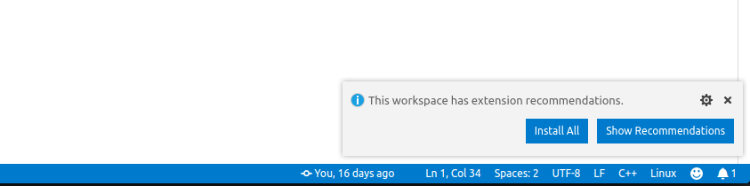
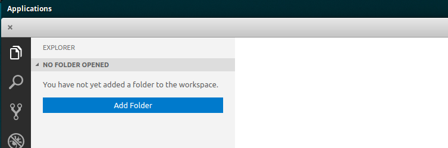

# Package buildconf

[Overview of an autoproj](docs/autoproj.md) file in buildconf

Build configuration based on [autoproj](https://github.com/rock-core/autoproj), specific to your project

## Enviroment

We recommend using one of the variations of [Ubuntu](http://releases.ubuntu.com/) as an example of `16.04 LTS (Xenial Xerus) 64-bit` to [ROS Kinetic](http://wiki.ros.org/kinetic) or `18.04 LTS (Bionic Beaver) 64-bit` to [ROS Melodic Morenia](http://wiki.ros.org/melodic), distros based Ubuntu can also be used, like [Linux Mint](https://linuxmint.com/edition.php?id=246).

- [ROS Kinetic](http://wiki.ros.org/kinetic): check the instructions on Dependencies.
- [ROS Melodic Morenia](http://wiki.ros.org/melodic): check the instructions on Dependencies.

## Dependencies

- ### Autoproj

  `autoproj` has a few dependencies that you must install manually:

  ```sh
    sudo apt install ruby-dev wget git
  ```

- ### Git-LFS

  Download the installation script:

  ```sh
    curl -s https://packagecloud.io/install/repositories/github/git-lfs/script.deb.sh | sudo bash
  ```

  And update:

  ```sh
    sudo apt update
  ```

  Installing is also easy:

  ```sh
     sudo apt install git-lfs
     git lfs install
  ```

- ## Using this build conf

  For **only non Ubuntu SO**, you need to export a environment variable to Autoproj thinks you are on Ubuntu and recognize its packages:

  ```sh
    export AUTOPROJ_OS="ubuntu,debian:16.04,xenial,xerus"
  ```

  or 18.04 Bionic Beaver e.g.,

  ```sh
    export AUTOPROJ_OS="ubuntu,debian:18.04,bionic,beaver"
  ```

  For convenience, it's recommended to add it at the end of your `~/.bashrc`.

  Before proceeding, you need to configure your git username and e-mail ([more info](https://help.github.com/articles/setting-your-username-in-git/)):

  ```sh
    git config --global user.name "Your username"
    git config --global user.email yourgitemail@example.com
  ```

  Now, configure a ssh key access to github, so `autoproj` can access private project repositories. To do so, follow the [github tutorial](https://help.github.com/articles/connecting-to-github-with-ssh/).

The idea in an `autoproj` installation is that people share definitions for a set of packages that can depend on each other. Then, anyone can cherry-pick in these definitions to build its own installation (in practice, one builds a complete configuration per-project) check `autoproj` [configuration structure](autoproj.md)

- Now, to bootstrap a full installation:
  1. create a dir to your `workspace`

  ```sh
     mkdir <project_name>_ws
     # eg mkdir jiro_ws or rbim_ws
  ```

  2. In the new directory download this script `bootstrap.sh` to create an `autoproj` installation.

  ```sh
     cd <project_name>_ws
     # eg cd jiro_ws or rbim_ws
     wget -c <raw_file_bootstrap_url> -O bootstrap.sh
  ```

3. Now  run `bootstrap.sh`

    ```sh
      sh bootstrap.sh
    ```

- It is also possible to clone the build conf package and run `bootstrap.sh`.

  ```sh
      git clone https://github.com/<project_name>-buildconf.git <project_name>_ws
      cd <project_name>
      sh bootstrap.sh
  ```

This will take some time because it will download and compile every package of the project. It asks for sudo permission to install the ruby-dev package.

  > If you have any problem with git clone commands, its because you don't have access to that specific repository.

Once it's done, setup the environment and start working:

  ```sh
    source env.sh
    source devel/setup.sh
  ```

This folder is now your **new workspace**.

Now that ROS Kinetic is installed, add the environment configuration command to your `~/.bashrc`, necessary so your system can recognize ROS commands and packages:

```sh
   source /opt/ros/kinetic/setup.sh
```

Adding to `~/.bashrc` it's only a convenience, so you won't need to execute the same command everytime you open a terminal or or create an alias on `~/.bashrc`

## How use autoproj

Basic autoproj commands:

- `autoproj update` or simply `aup`: updates the workspace.
- `autoproj update <package>` : will ask you wether you want to install support for `<package>`. Il will also download all required dependencies.
- `amake`: build your workspace
- `autoproj --help`: for more information and commands

### Changing autoproj build configuration

On your workspace, this build conf project will be at `autoproj` folder. From there you can configure the packages you are using (`manifest` file) and override package sources (`overrides.yml` file). Most of the ROS Kinetic and ROS Melodic packages are already configured on manifest package_set reference `bir.ros-package_set` and third-party and commons packages are configured in `bir.ros-common_package_set`

1. Edit the `autoproj/manifest` file and add to the relevant sections, if necessary:

  ```yaml
    package_sets:
      - github: Brazilian-Institute-of-Robotics/bir.ros-package_set
        private: true
  ```

2. If you want to add a package, you just need to refer them at the layout tag from `manifest`:

  ```yaml
    layout:
      - desktop_full
      - gazebo_ros_demos
  ```

3. If you have already installed some packages out of Autoproj, you can tell Autoproj not to install them by adding to the `manifest` file, for instance, e.g:

 ```yaml
ignore_packages:
  - blender
  - yarp
  ```

If you want to add a package, catkin_metapackage or metapackage on `<your_project>.autobuild` file, with the commands:

- `catkin_package`: for a simple package repository;
- `catkin_repository`: for a repository with more than one package and no metapackage;
- `catkin_metapackage`: for a repository with a ROS metapackage.

If you need outside ROS resources that need `apt` commands to install, you can add it at `ros.osdeps` file.

Have fun!

## Visual Studio Code workflow

### 1. Installing the recommended extensions

If you are interested to use [Visual Studio Code](http://code.visualstudio.com/), the generated workspace has a few extensions recommendations. Once you open the workspace for that first time in Visual Studio Code, it will prompt you about installing them.



To do that, just click 'Install All' once you see the notification above.

### 2. Adding packages to VS Code's workspace

When you first open the workspace, it will be empty. Click the 'Add folder' button as you see below:



To work as expected, you must add only the root of the package to this workspace (the folder that contains a package.xml/manifest.xml file in it). DO NOT add the entire workspace or the `src` folder.

### 3. Building packages

To build a package use the 'Terminal -> Run build task' menu or the `Ctrl+Shift+B` shortcut.

### 4. More information

For more information on how to use the Autoproj extension for Visual Studio Code, [check this out.](http://github.com/g-arjones/vscode-autoproj)

Have fun!
